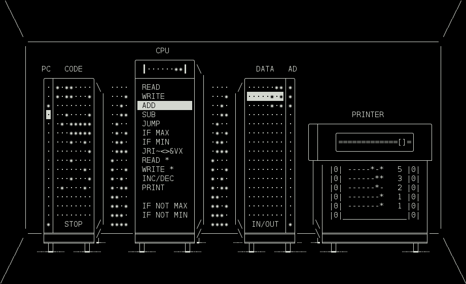

Comp Mark II
============

#### Updated version of [**Comp**](https://github.com/gto76/comp-cpp) – Simple 4-bit/1 Hz virtual computer for learning purposes



**For quick start see [HOW TO RUN](README.md#how-to-run-on)**

Overview
--------

* Processor has one 8 bit register.
* Ram is separated in two address spaces; one for instructions, called CODE, and another for data, called DATA.
* All instructions are 8 bits long.
* Execution starts at the first address (0) of the CODE ram.
* Execution stops when program reaches the last address (15) of the CODE ram.
* Most of instructions consist of instruction code and address:
```
instruction code - 4 bits
  |  +-- address - 4 bits
  v  v
----***-  ->  READ 14  ->  Copy value stored at address 14 of DATA ram to register.
```
* All addresses specified by instructions refer to DATA ram, except for addresses of *Execution Control* instructions (`JUMP`, `IF MAX`, `IF MIN`, ...). They refer to CODE part of ram.
* Some instructions (`JRI~<>&V`) do not specify address. They operate on register (`SHIFT L/R`, `NOT`, ...) or between register and predefined DATA address (`AND`, `OR`, ...).
* Whatever gets written to the last address is sent to the printer, or to *stdout* if program is running in a non-interactive mode.
* When reading from the last address (15), we get a random byte value, or a single word from *stdin*, if program is running in non-interactive mode.
* In this word every `*` is interpreted as *true* and all other characters as *false*. If word starts with a digit, it is then read as a number and converted appropriately.
* Program will start in a non-interactive mode when any input is piped in, or any option is given. For instance `echo | ./comp <file>`
* Programs can be saved with `s` key and loaded by passing their name as a parameter.
* If more than one filename is passed, the computers will be chained together (*stdin* > *comp-1* > *comp-2* > ... > *stdout*).
* If folder is passed, all files in that folder that have suffix `.cm2` will be loaded in an alphabetical order.

Instruction set
---------------
Most of the instructions, together with the highlighted word that they use/modify, are pretty self-explainatory. Exception are instructions that start with `-***`, and are a part of `JRI~<>&VX` instruction cluster. They are:  
 * `J` – JUMP_REG,
 * `R` – READ_REG,
 * `I` – INIT,
 * `~` – NOT,
 * `<` – SHIFT_L,
 * `>` – SHIFT_R,
 * `&` – AND,
 * `V` – OR,
 * `X` – XOR.

(Use Shift–Left/Right Arrow to easily shift between them.)  
Detailed descriptions of all instructions can be found [**HERE**](doc/instruction-set.md).

Keys
----
* `Space` – Flip bit
* `Tab` – Switch address space
* `Enter` – Start/pause execution
* `Esc` – Cancel execution
* `Delete`, `Backspace` – Delete word or move following words up if empty
* `Insert`, `]` – Insert empty word and move following words down
* `s` – Save ram to textfile named `punchcard-<num>.cm2`. To load it, start program with `./comp <file>`
* `q` – Save and quit

Detailed descriptions of all keys can be found [**HERE**](doc/keys.md).

Options
-------
* `--non-interactive`, `-n` – Runs program in a non-interactive mode (withouth a gui). This option is not necessary if any other option is present, or if input is piped in.
* `--char-output`, `-c` – Converts numbers to characters using ASCII standard when printing to *stdout*.
* `--filter`, `-f` – Convert characters to numbers when reading from *stdin*, and numbers to characters when printing to *stdout*.
* `--game`, `-g` – Same as *filter*, but reads characters directly from keyboard.
* `parse` – Converts program to c++ code (other options may be specified).
* `compile` – Compiles program to executable file, by converting it to c++ code and running g++ compiler (other options from above may be specified). Only difference between compiled program and one run on the Comp Mark II is in execution speed.


How to run on…
--------------

### Windows

* Install *Tiny Core Linux* on *VirtualBox* using this [**instructions**](https://github.com/gto76/my-linux-setup/tree/gh-pages/conf-files/tiny-core-linux).
* Run the *UNIX* commands.

### UNIX
*Make* and *g++* need to be installed first. On *Ubuntu* and *Debian* you can get them by running `sudo apt-get install build-essential`, on *OS X* they get installed automatically after running *make*.
```
$ git clone https://github.com/gto76/comp-m2.git
$ cd comp-m2
$ ./run
```

### Docker
```
$ docker run -it --rm mvitaly/comp-m2 <options>
```

Examples
--------

#### Fibonacci Sequence
```
$ ./comp --non-interactive examples/fibonacci.cm2
-------*   1
-------*   1
------*-   2
------**   3
-----*-*   5
----*---   8
...
```

#### Multiply
```
$ echo "3 4" | ./comp examples/multiply.cm2
----**--  12
```

#### Hello World
```
$ ./comp --char-output examples/hello-world.cm2
Hello world
```

#### To Upper Case
```
$ echo "Hello world" | ./comp --filter examples/to-upper-case.cm2
HELLO WORLD
```

#### Cat and Mouse
Two player game
```
$ ./comp compile --game examples/cat-and-mouse/
Compiled as cat-and-mouse
$ ./cat-and-mouse
```
```
##################
#                #
#  C             #
#                #
#                #
#                #
#                #
#                #
#                #
#                #
#                #
#                #
#                #
#                #
#                #
#             m  #
#                #
##################
```

Further Development
-------------------
Check out the blueprint of [**Mark III**](https://github.com/gto76/comp-m2/issues/4) model.
